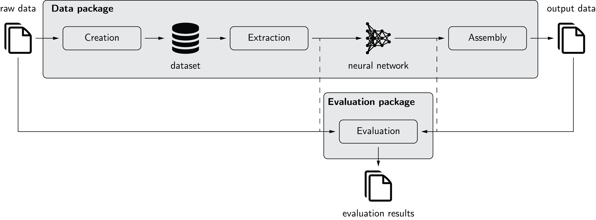

.. include:: ../README.rst

Main Features
=============
pymia's main features are data handling and metrics for result evaluation in deep learning-based medical image analysis.
The figure below illustrates the use of pymia for deep learning-based projects. We recommend following our
:ref:`examples <examples>`. Further, pymia provides basic image filtering and manipulation functionality.

Getting Started
===============

If you are new to pymia, here are a few guides to get you up to speed right away.

.. toctree::
    :maxdepth: 1
    :hidden:
    :caption: Getting started

    installation
    examples
    contribution
    history
    acknowledgment

* :doc:`installation` helps you installing pymia.

* :doc:`examples` give you an overview of pymia's intended use.

* Do you want to contribute? See :doc:`contribution`.

* :doc:`history`.

* :doc:`acknowledgment`.

Citation
========
If you use pymia for your research, please acknowledge it accordingly by referencing ``https://github.com/rundherum/pymia`` in a footnote or your acknowledgments.

.. toctree::
    :maxdepth: 3
    :caption: Packages

    pymia.data
    pymia.evaluation
    pymia.filtering

Indices and tables
==================

* :ref:`genindex`
* :ref:`modindex`
* :ref:`search`
