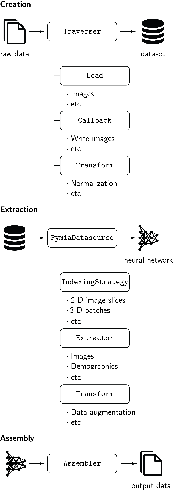
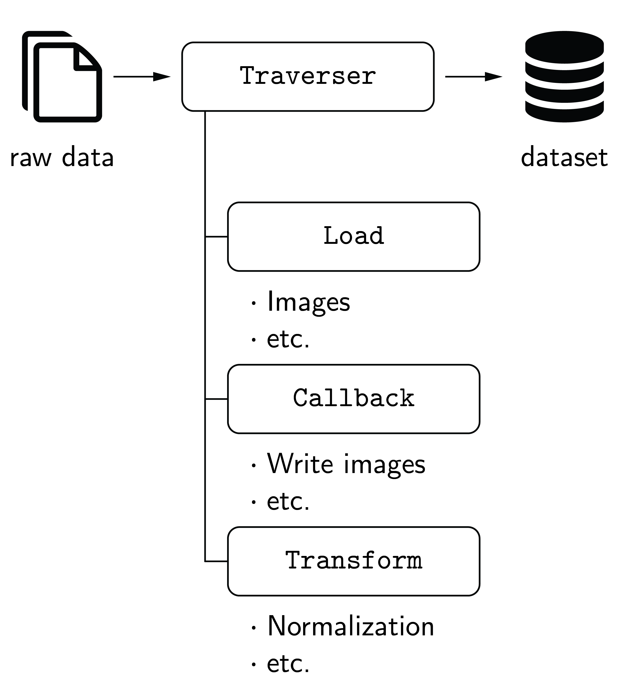

.. module:: pymia.data

Data (:mod:`pymia.data` package)
================================

This data package provides data handling functionality for machine learning (especially deep learning) projects.
The concept of the data package is illustrated in the figure below.

The three main components of the data package are creation, extraction, and assembly.

**Creation**

The creation of a dataset is managed by the :class:`.Traverser` class, which processes the data of every subject (case) iteratively. It employs :class:`.Load` and :class:`.Callback` classes to load the raw data and write it to the dataset. :class:`.Transform` classes can be used to apply modifications to the data, e.g., an intensity normalization. For the ease of usage, the defaults :func:`.get_default_callbacks` and :class:`.LoadDefault` are implemented, which cover the most fundamental cases. The code example :ref:`Creation of a dataset <example-data1>` illustrates how to create a dataset.

**Extraction**

Data extraction from the dataset is managed by the :class:`.PymiaDatasource` class, which provides a flexible interface for retrieving data, or chunks of data, to form training samples. An :class:`.IndexingStrategy` is used to define how the data is indexed, meaning accessing, for instance, an image slice or a 3-D patch of an 3-D image. :class:`.Extractor` classes extract the data from the dataset, and :class:`.Transform` classes can be used to alter the extracted data. The code example :ref:`Data extraction and assembly <example-data2>` illustrates how to extract data.

**Assembly**

The :class:`.Assembler` class manages the assembly of the predicted neural network outputs by using the identical indexing that was employed to extract the data by the :class:`.PymiaDatasource` class. The code example :ref:`Data extraction and assembly <example-data2>` illustrates how to assemble data.

.. image:: ./images/fig-data-assembly.png
  :width: 200
  :align: center
  :alt: Assembly of predicted outputs.

Subpackages
-----------

.. toctree::

    pymia.data.backends
    pymia.data.creation
    pymia.data.extraction

Assembler (:mod:`pymia.data.assembler` module)
----------------------------------------------

.. automodule:: pymia.data.assembler
    :members:
    :show-inheritance:

Augmentation (:mod:`pymia.data.augmentation` module)
----------------------------------------------------

.. automodule:: pymia.data.augmentation
    :members:
    :show-inheritance:

Conversion (:mod:`pymia.data.conversion` module)
------------------------------------------------

.. automodule:: pymia.data.conversion
    :members:
    :show-inheritance:

Definition (:mod:`pymia.data.definition` module)
------------------------------------------------

.. automodule:: pymia.data.definition
    :members:
    :show-inheritance:

Index expression (:mod:`pymia.data.indexexpression` module)
-----------------------------------------------------------

.. automodule:: pymia.data.indexexpression
    :members:
    :undoc-members:
    :show-inheritance:

Subject file (:mod:`pymia.data.subjectfile` module)
---------------------------------------------------

.. automodule:: pymia.data.subjectfile
    :members:
    :undoc-members:
    :show-inheritance:

Transformation (:mod:`pymia.data.transformation` module)
--------------------------------------------------------

.. automodule:: pymia.data.transformation
    :members:
    :undoc-members:
    :show-inheritance:
