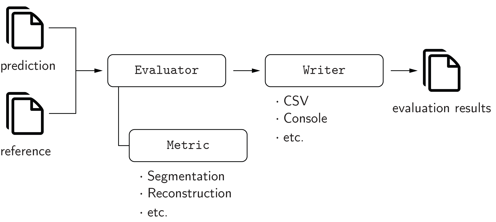

.. module:: pymia.evaluation

Evaluation (:mod:`pymia.evaluation` package)
============================================

The evaluation package provides metrics and evaluation functionalities for image segmentation, image reconstruction,
and regression. The concept of the evaluation package is illustrated in the figure below.

All metrics (:mod:`pymia.evaluation.metric.metric` package) implement the
:class:`pymia.evaluation.metric.base.Metric` interface, and can be used with the :mod:`pymia.evaluation.evaluator` package
to evaluate results (e.g., with the :class:`pymia.evaluation.evaluator.SegmentationEvaluator`).
The :mod:`pymia.evaluation.writer` package provides several writers to report the results, and statistics of the results,
to CSV files (e.g., the :class:`pymia.evaluation.writer.CSVWriter` and :class:`pymia.evaluation.writer.CSVStatisticsWriter`)
and the console (e.g., the :class:`pymia.evaluation.writer.ConsoleWriter` and
:class:`pymia.evaluation.writer.ConsoleStatisticsWriter`).

Refer to :ref:`Evaluation of results <example-evaluation1>` for a code example on how to evaluate segmentation results.
The code example :ref:`Logging the training progress <example-evaluation2>` illustrates how to use the evaluation package to
log results during the training of deep learning methods.

Subpackages
-----------

.. toctree::

    pymia.evaluation.metric

The evaluator module (:mod:`pymia.evaluation.evaluator`)
--------------------------------------------------------

.. automodule:: pymia.evaluation.evaluator
    :members:
    :undoc-members:
    :show-inheritance:

The writer module (:mod:`pymia.evaluation.writer`)
----------------------------------------------------------

.. automodule:: pymia.evaluation.writer
    :members:
    :undoc-members:
    :show-inheritance:
